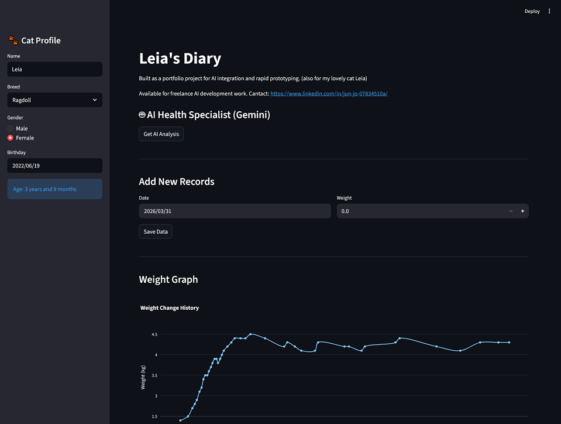

# Leia's Diary – AI Document Analyzer

A simple AI-powered document analysis web application built with Python and Streamlit.

## Features

* Upload documents
* AI-based summarization
* Keyword extraction
* Simple web interface
* Fast prototyping for AI workflows

## Tech Stack

* Python
* Streamlit
* LLM API
* Document processing

## Use Case

This tool demonstrates how AI can be integrated into business workflows to automatically analyze large documents.

## Live Demo

https://eevb4ynhqi56kauezbc5cv.streamlit.app/

## Screenshots

## About Me

Freelance AI & python developer and researcher based in Germany.
Available for AI integration, data automation, and MVP development.

## Contact

https://www.linkedin.com/in/jun-jo-07834510a/
